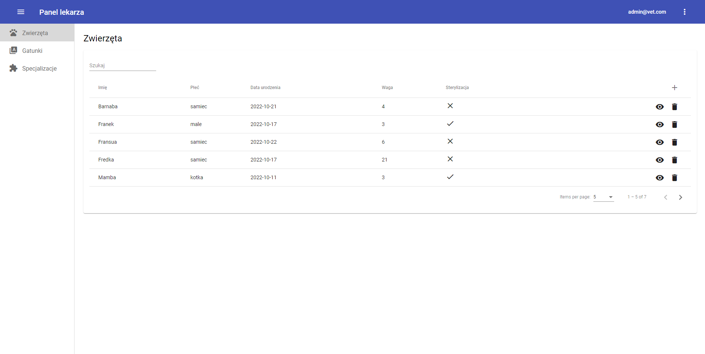
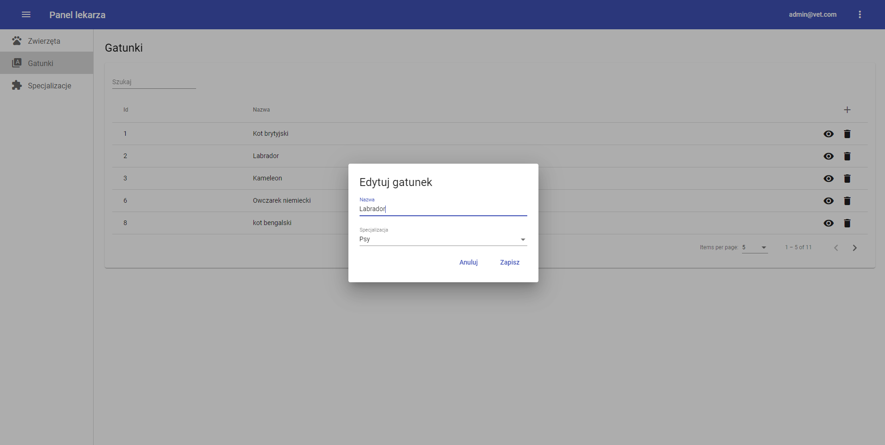

# Klinika weterynaryjna
Projekt dotyczy stworzenia prostej aplikacji służącej do prowadzenia bazy danych lecznicy zwierząt / kliniki weterynaryjnej. Docelowo umożliwia użytkownikowi przeglądanie dokumentacji medycznej swoich zwierząt oraz rezerwowania wizyt.

## Przykładowe widoki aplikacji
1. Lista zwierząt

2. Edycja gatunku

   
## Technologie

### Stack technologiczny:
* Angular 14
* Angular material
* SCSS
* rxjs
* jwt

### Zastosowane rozwiązania:
* implementacja state managementu na behaviour subjectach
* interceptor doklejający authorization header do requestów http
* podział na lazy-loadowane moduły
